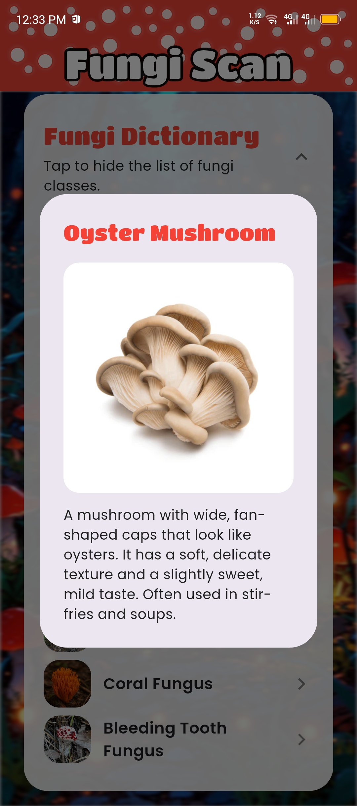
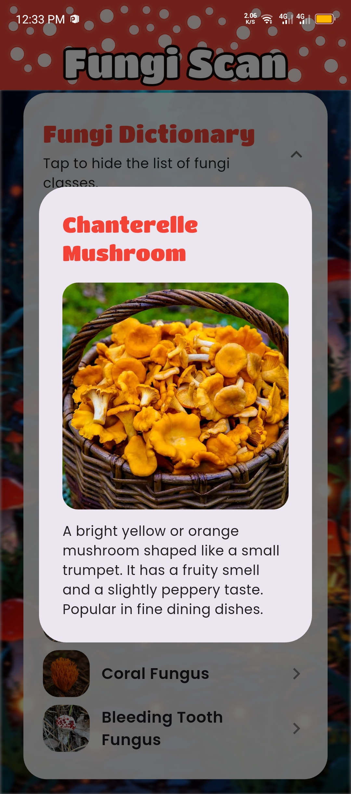
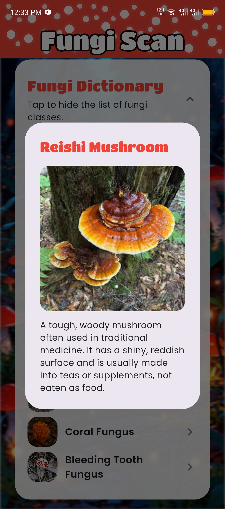
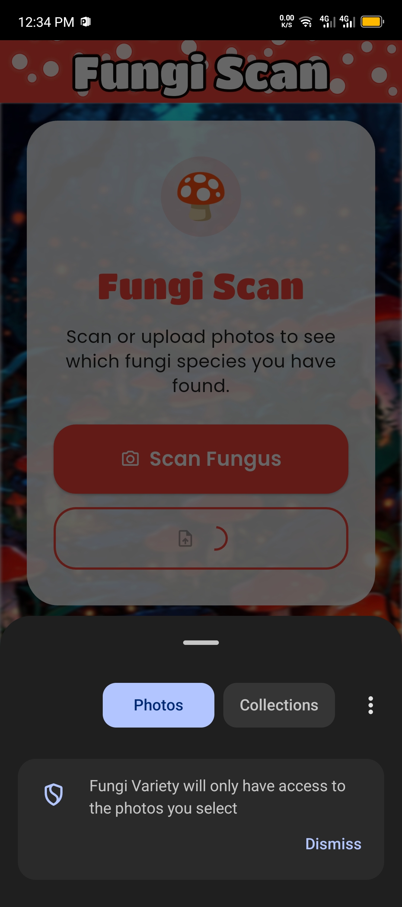

<div align="center">
  


<br/>
<br/>


[](https://github.com/marsrodel)

</div>

---

## 🎓 About Me

```python
class Student:
    def __init__(self):
        self.name = "Rodel James G. Maraon"
        self.role = "College Student"
        self.location = "Cabadbaran City/Philippines"
        self.education = "Information Technology"
        self.languages = ["HTML", "CSS", "JavaScript", "Python", "Java", "Dart"]
        self.currently_learning = ["Web Development", "Mobile Apps"]
        self.hobbies = ["Coding", "Gaming", "Music", "Reading", "Watching Videos"]
    
    def say_hi(self):
        print("Thanks for dropping by! Let's connect and build something cool together!")

me = Student()
me.say_hi()
```

- 🎓 Currently studying **Information Technology** at **Caraga State University Cabadbaran Campus**
- 🌱 Learning web development and exploring mobile app development
- � Working on small projects to improve my coding skills
- 🎯 Goal: Build projects that solve real problems
- 🎮 When I'm not coding, I'm probably doing other leisure activities
- 📫 Reach me at: marsrodel@gmail.com

---

## 🛠️ Languages & Tools I've Learned

<div align="center">


</div>

---

## 📊 GitHub Stats

<div align="center">


<br/>
<br/>

<!-- STATS BOX -->

<table width="100%">
<tr>
<td width="50%" align="center">

### ▢ GitHub Stats

</td>
<td width="50%" align="center">

### ▢ GitHub Streak

</td>
</tr>
</table>


</div>

---

## 🌱 Currently Learning

- 📱 Mobile App Development with **Flutter/Dart**
- � Building responsive websites with **HTML, CSS & JavaScript**
- 🐍 Data structures and algorithms with **Python**
- ☕ Object-oriented programming with **Java**

---

## 🚀 Current Project: Fungi Scan (Flutter App)

<p align="justify">
This project is a mobile application called <strong>Fungi Scan</strong>, developed using <strong>Flutter</strong> as part of my coursework in Information Technology. Fungi Scan is a simple fungi image classification app that helps users identify different mushroom species using a trained image recognition model. The app can analyze mushrooms either by <strong>taking a photo with the camera</strong> or by <strong>uploading an existing image</strong>, making it flexible to use in real situations.
<br/><br/>
Fungi Scan focuses on a specific set of mushroom classes that are available in the built-in dictionary. After running a scan, the app shows the predicted class together with <strong>confidence percentages</strong>, as well as analytics such as detections per class and a history of past scans. Overall, this project allowed me to practice Flutter UI design, basic machine learning integration for image classification, and organizing app features into a clear and user-friendly interface.
</p>

---

### 🏠 Main Page & 📖 Fungi Dictionary

<table>
  <tr>
    <td align="center">
      <strong>Main Page</strong><br/>
      <br/>
      <sub>The Main Page is the starting point of the app. From here, users can navigate to the dictionary, open the camera or upload screen, and access other features of Fungi Scan.</sub>
    </td>
    <td align="center">
      <strong>Fungi Dictionary</strong><br/>
      <br/>
      <sub>The Dictionary lists the different fungi that can be recognized by the app. Each entry represents a species that users can scan and learn about.</sub>
    </td>
  </tr>
</table>

---

### 🍄 Supported Fungi Classes

Below are sample screens showing the fungi that Fungi Scan can classify:

<p align="center">
  
  
  
  
  
</p>

<p align="center">
  
  
  
  
  
</p>

These screens show the mushroom species included in the model, helping users know which fungi they can scan with the app.

---

### 📷 Capture or Upload Images & ✅ Scan Result

<table>
  <tr>
    <td align="center">
      <strong>Capture or Upload Images</strong><br/>
      
      <br/>
      <sub>Users can either take a new photo using the camera or upload an existing image from their device. These images are then sent to the model for fungi classification.</sub>
    </td>
    <td align="center">
      <strong>Scan Result</strong><br/>
      <br/>
      <sub>After a scan, the Result screen shows the predicted fungi class along with confidence percentages, so users can see how likely each class is.</sub>
    </td>
  </tr>
</table>

---

### 📈 Analytics, Detections per Class & 🕒 Scan History

<table>
  <tr>
    <td align="center">
      <strong>Analytics & Detections per Class</strong><br/>
      
      <br/>
      <sub>The Analytics screen summarizes how the app is being used, including how many detections each fungi class has. The Detections per Class chart visualizes how often each type of mushroom has been scanned.</sub>
    </td>
    <td align="center">
      <strong>Scan History</strong><br/>
      <br/>
      <sub>The History page keeps a record of past scans, including the detected class, accuracy, and time. This lets users review previous results and track their usage of Fungi Scan.</sub>
    </td>
  </tr>
</table>

---

## 🎯 2025 Goals

- [ ] Build and deploy my first full web application
- [ ] Contribute to open source projects
- [ ] Learn a new framework (React or Flutter)
- [ ] Complete 100 days of code challenge
- [ ] Create a personal portfolio website

---

## 🌐 Connect With Me

<div align="center">


[](https://instagram.com/bagofjellybeansupmyaess)
[](https://twitter.com/marsrodel)
[](mailto:marsrodel@gmail.com)
[](https://discord.com/users/nalilitoangpipiko)

</div>

---

## 💭 Quote of the Day

<div align="center">


</div>

---

<div align="center">

### ✨ "Learning to code, one commit at a time" ✨


**Thanks for visiting! Feel free to check out my repos and connect! 🚀**

</div>
